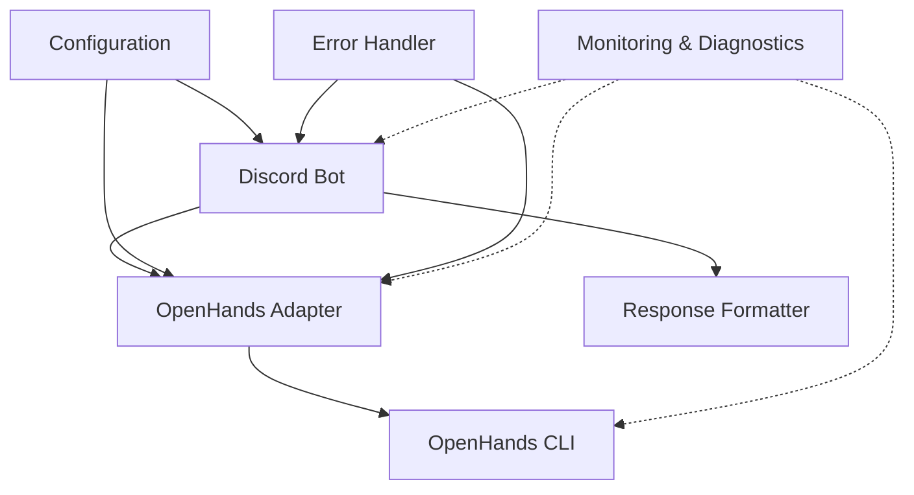
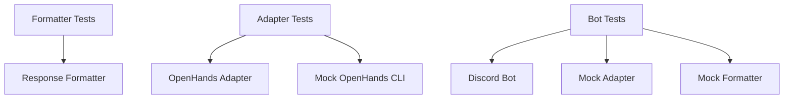
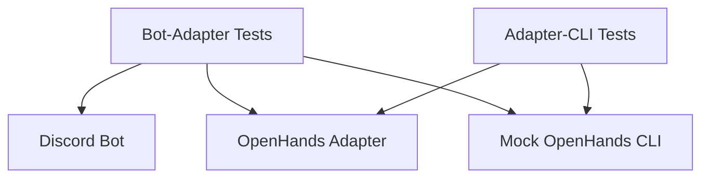
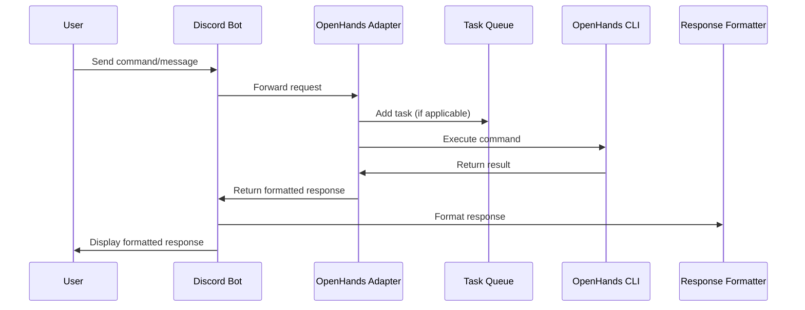
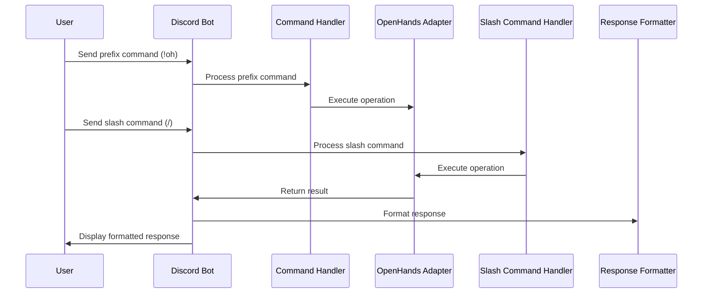

# System Patterns

## System Architecture

The OpenHandsDiscordAdapter System follows a modular architecture with clear separation of concerns. The system is organized into the following components:

### Key Components

1. **Discord Bot (`src/bot/bot.py`)**
   - Handles Discord events and commands
   - Manages user interactions
   - Routes requests to the OpenHands adapter
   - Presents formatted responses back to users
   - Supports both prefix commands and slash commands

2. **OpenHands Adapter (`src/adapter/openhands_adapter.py`)**
   - Interfaces with the OpenHands CLI
   - Manages task queues and execution
   - Maintains user sessions and conversation context
   - Handles asynchronous task processing

3. **Response Formatter (`src/utils/formatter.py`)**
   - Formats task results and status updates for Discord
   - Creates Discord embeds with appropriate styling
   - Handles message chunking for large responses
   - Provides help information for both prefix and slash commands

4. **Configuration (`src/config.py`)**
   - Manages environment variables
   - Provides configuration validation
   - Centralizes system settings

5. **Error Handler (Planned)**
   - Provides centralized error handling
   - Implements retry mechanisms for transient errors
   - Generates user-friendly error messages

6. **Monitoring & Diagnostics (Planned)**
   - Collects system health metrics
   - Provides diagnostic commands
   - Generates alerts for system issues

## Design Patterns

### 1. Adapter Pattern
The OpenHandsAdapter acts as an adapter between the Discord bot and the OpenHands CLI, translating Discord commands into OpenHands operations.

### 2. Command Pattern
The Discord bot uses the command pattern to handle different user commands (`!oh task`, `!oh status`, etc.), encapsulating each command as a separate function. This pattern is also applied to slash commands (`/task`, `/status`, etc.).

### 3. Asynchronous Task Queue
The system uses an asynchronous task queue to manage and process OpenHands tasks, allowing for non-blocking operation and concurrent task execution.

### 4. Singleton Pattern
The OpenHandsAdapter is implemented as a singleton to ensure a single instance manages all OpenHands interactions.

### 5. Factory Pattern
The formatter module acts as a factory for creating different types of Discord embeds based on the content being displayed.

### 6. Circuit Breaker Pattern (Planned)
To improve error handling, a circuit breaker pattern will be implemented to prevent repeated failures when external services are unavailable.

### 7. Repository Pattern (Planned)
For persistent storage of task and user data, a repository pattern will be used to abstract the storage implementation.

### 8. Strategy Pattern (Planned)
The response formatting will be enhanced with a strategy pattern to support different output formats based on content type and user preferences.

### 9. Facade Pattern
The Discord bot acts as a facade, providing a simplified interface to the complex subsystems (OpenHands CLI, task management, etc.).

## Testing Patterns

### 1. Unit Testing
Individual components are tested in isolation using mock objects to replace dependencies.

### 2. Integration Testing
Tests the interaction between components, ensuring they work together correctly.

### 3. End-to-End Testing
Tests the entire system flow from Discord command to OpenHands execution and response.

## Component Relationships

### Discord Bot → OpenHands Adapter
- The bot forwards user commands and messages to the adapter
- The adapter returns results that the bot presents to users

### OpenHands Adapter → OpenHands CLI
- The adapter executes the OpenHands CLI as a subprocess
- It passes user inputs and retrieves outputs

### Discord Bot → Response Formatter
- The bot uses the formatter to create user-friendly Discord embeds
- The formatter handles different types of content (task results, status updates, help information)

## Data Flow

## Command Handling Flow

## Error Handling Strategy
The system implements a comprehensive error handling strategy:
1. Command validation in the Discord bot
2. Error catching in the adapter's task execution
3. Graceful degradation with informative error messages
4. Timeout handling for long-running tasks
5. Retry mechanisms for transient errors (planned)
6. Circuit breaker for external service failures (planned)

## Security Strategy
The system implements security measures to protect against common vulnerabilities:
1. Input validation to prevent injection attacks
2. Permission checks for command execution
3. Rate limiting to prevent abuse
4. Secure handling of API keys and sensitive information

## Performance Optimization
To ensure responsive user experience, the system includes:
1. Asynchronous processing for non-blocking operations
2. Task queue management to prevent overloading
3. Caching for frequently used data (planned)
4. Message pagination for large responses (planned)

## Internationalization Support
For multi-language support, the system implements:
1. Documentation in multiple languages (English and Japanese)
2. Planned localization of bot messages and responses
3. Future support for user language preferences
4. Locale-aware formatting for dates, times, and numbers 